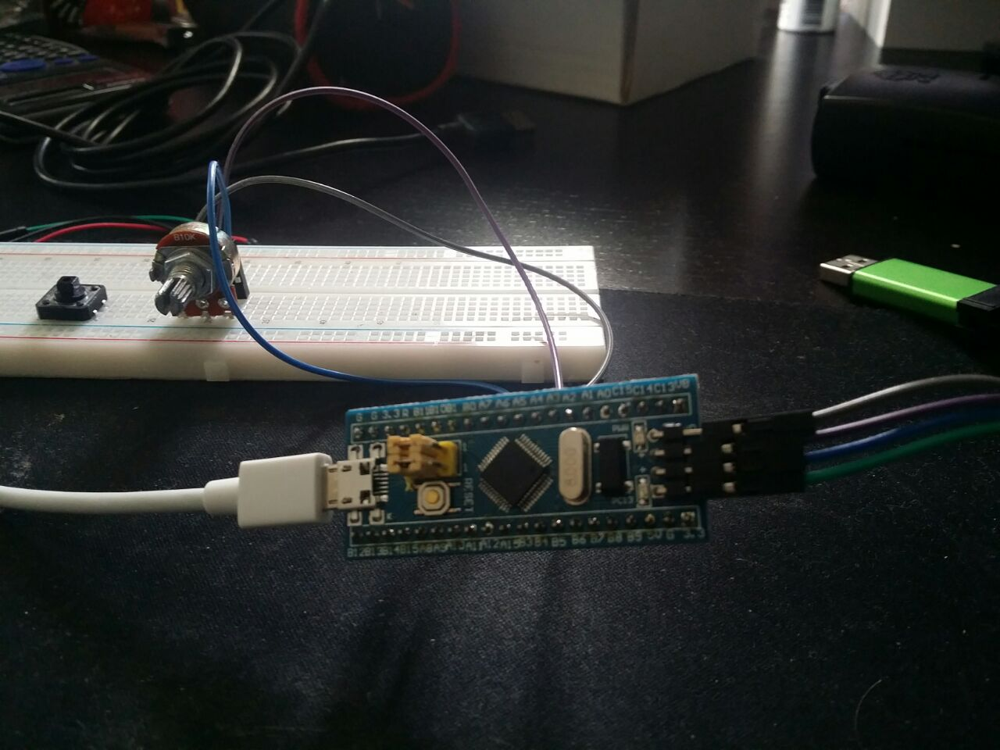

# Midi Controller using Stm32F103 and PlatformIO, Proof of Concept



## Requirements

- A Stm32F103 "Blue Pill" microcontroller
- PlatformIO IDE, the CLI should probably work aswell
- [STLINK/V2 programmer/debugger](https://www.adafruit.com/product/2548) for the  Stm32F103 microcontroller
- A 10k potentiometer

## Setup

 - Install the VsCode extension PlatformIO.

 - Do either of the following:

    - Clone this repository and open the project in PlatformIO. Make sure that .pioenvs and .piolibdeps are created.

    - Create a new project, choose the Stm32F103 board with the Arduino framework. The project configuration is defined in platformio.ini. Add USBComposite library to platformio.ini:
        ```
        lib_deps =
            USBComposite for STM32F1
        ```
        Replace the project main.cpp with the repository main.cpp.

    - Alternative instructions for setting up a PlatoformIO project for the Stm32F103 can be found here: 
    
        https://docs.platformio.org/en/latest/boards/ststm32/genericSTM32F103C8.html

- In the PlatformIO context menu build and upload the project. PlatformIO will use the ST-LINK programmer/debugger by default.

- After the project is uploaded, connect the Stm32F103 using the built-in usb connector. It should show up as Maple generic midi device.

## Hardware Connections

[Pinout sheet for the STM32F1](https://wiki.stm32duino.com/images/a/ae/Bluepillpinout.gif)

- Connect the left pin on the potentiometer to GND.

- Connect the right pin on the potentiometer to 3.3V (5V resulted in a overflow).

- Connect the middle pin on the potentiometer to A5.

## Result

The Stm32F103 should now show up as a midi device that sends a control change command with a value from 0-127 on channel 5 when the potentiometer is rotated.

This concept can be used to build a midi controller for DJ- or audio production software.